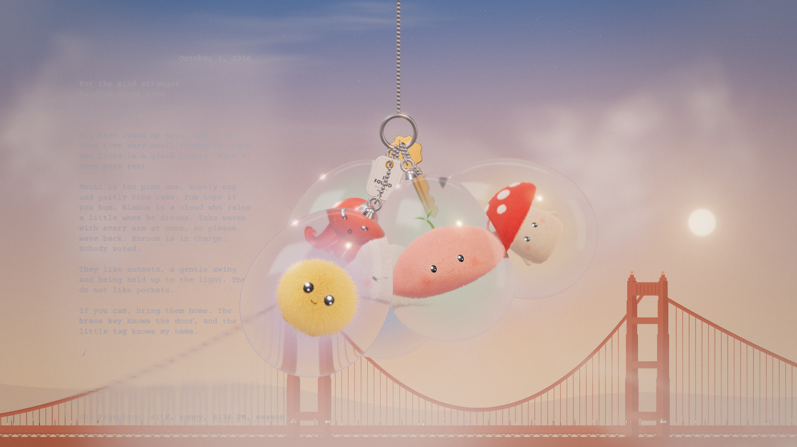
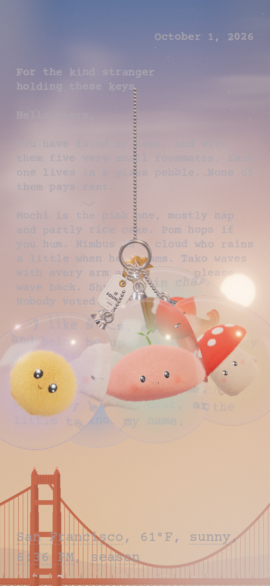

# Keychain Remake · 玻璃石钥匙扣

一串挂在日落天空里的钥匙扣，五只毛绒小怪住在玻璃石里。可以抓起来甩一甩、扯下来再挂回去，天空跟着真实的时间和天气变化。



<p align="center">
  
</p>

## 角色

| 角色 | 造型 | 材质 |
| --- | --- | --- |
| Pom | 黄色毛球 | 分层长毛，甩动时会抖 |
| Mochi | 粉色糯米团子，头顶小芽 | 毛毡 + 天鹅绒光泽 |
| Shroom | 红帽白点小蘑菇 | 毛毡 |
| Tako | 珊瑚色小章鱼 | 软胶 |
| Nimbus | 白色云朵 | 短绒 |

所有角色都是 three.js 实时建模，透过玻璃能看到真实的折射和视差。

## 功能

- **钥匙扣物理**：手写 Verlet 模拟，可拖拽、甩动，拉太远会断开，靠近钥匙环会重新挂上
- **玻璃石**：透射 + 薄膜彩虹 + 清漆层
- **天空**：渐变、噪声云、太阳和星星随日出日落变化，大桥剪影随光线着色
- **实时天气**：接入 [Open-Meteo](https://open-meteo.com/)，可切换城市、天气、时间、季节
- **天上的信**：打字机字体 + 手写签名

## 快速开始

```bash
npm install
npm run dev      # http://127.0.0.1:5173/
npm run build    # 打包到 dist/
```

调试参数：`?hour=21`（夜景）、`?weather=rain|snow|fog|cloudy|clear`、`?city=tokyo`、`?season=`

信件内容、署名和城市列表在 `src/content.ts` 里修改。

## 技术栈

Vite · TypeScript · three.js（WebGL）· 后期处理（Bloom + 自定义调色）

```
src/
├─ characters/  五只角色与材质（毛毡、长毛、软胶、眼睛）
├─ keychain/    物理、链条、玻璃石、挂件
├─ sky/         天空、云、地标剪影
├─ weather/     Open-Meteo 与日出日落计算
├─ letter/      天上的信
├─ renderer/    渲染器、环境光、后期
└─ ui/          加载页、天气行
```

## 致谢

灵感来自 [Tân Tân's Bots](https://tantan-keychain.vercel.app/)。本项目的角色、文案和代码均为原创实现。字体：Courier Prime、Homemade Apple（Google Fonts）。
